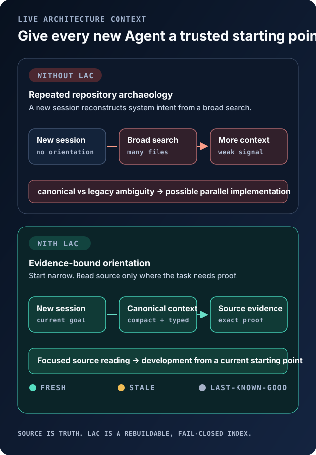
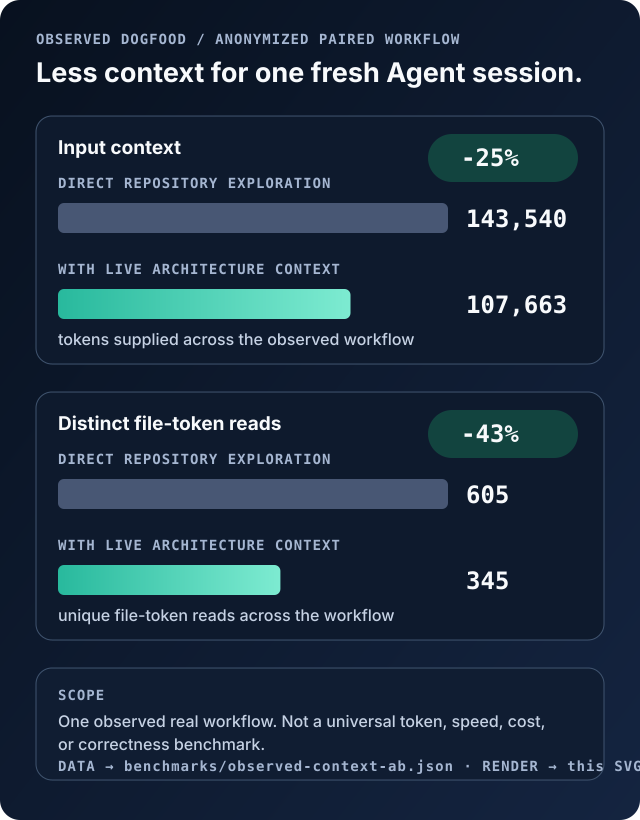
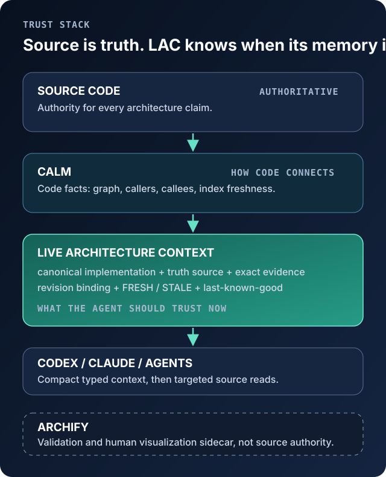

# Live Architecture Context

**The small, source-grounded answer to: “what should this coding agent trust right now?”**

Live Architecture Context (LAC) gives a new coding-agent session a compact,
revision-bound starting point: the canonical implementation, the declared truth
source, exact source evidence, and whether that retained orientation is still
fresh. Source code stays authoritative. LAC is a rebuildable index, not a
second architecture database.



## Measured context efficiency, not a token promise

One paired, fresh-session workflow on an anonymized long-lived repository used
**25% less input context** and **43% fewer distinct file-token reads** with
LAC. It is one observed real workflow, not a universal token, speed, cost, or
correctness benchmark.



The aggregate values, method, limitations, and deterministic SVG renderer are
checked in: [benchmark data](benchmarks/observed-context-ab.json) ·
[claim evidence](docs/public-face/claim-evidence.md) ·
`python tools/render_benchmark.py --check`.

## Install in 30 seconds

```sh
python -m pip install live-architecture-context
cd your-repository
archctx init --component service --evidence 'src/service.py::def serve'
```

`init` creates private `.archctx/architecture.json`, records a passing
last-known-good snapshot, and adds a small managed instruction block to the
existing `AGENTS.md`. A fresh Codex session then runs `status` before
substantive work and asks for canonical evidence only when it narrows the task.
It never invents a canonical system from filenames.

## Why LAC exists

Repository search answers “where does this string occur?” A code graph answers
“how does this code connect?” A diagram answers “how is this architecture
explained or validated?” Those remain useful. None alone gives a new Agent a
small, source-evidence-bound answer to all of these at once:

- Which implementation is canonical, rather than merely reachable or similar?
- What source is the truth source for this claim?
- Is the remembered answer current, stale, or unavailable?
- If validation fails, can the Agent retain last-good direction without silently
  treating it as current?



> **Source is truth. LAC remembers what is canonical, and knows when that memory is stale.**

### Core primitives

| Primitive | Agent outcome |
| --- | --- |
| `status` / `stale` | A tiny freshness result, not a hidden full snapshot. |
| `canonical` / `evidence` | One declared implementation and its exact source proof. |
| `search` | At most three candidates by default, plus explicit omitted counts. |
| `trace` / `impact` | Authored architecture relations stay separate from graph facts. |
| `refresh` / `snapshot` | Validate before atomic promotion; preserve last-good on failure. |
| `changed-since` / `drift` | Evidence-bound delta and configured high-value drift candidates. |

## Different jobs, complementary tools

This is a scope comparison, not a feature ranking. Each project below is useful
for a different question; the linked primary sources and caveats are maintained
in [comparison sources](docs/public-face/comparison-sources.md).

| Start with | Primary job | What it gives an Agent | What LAC adds instead of duplicating it |
| --- | --- | --- | --- |
| Direct repository search | Read current source | Exact files and strings | A compact, declared canonical starting point with freshness state. |
| [CALM](https://github.com/Eilodon/CALM) / [CodeGraphContext](https://github.com/CodeGraphContext/CodeGraphContext) | Code facts and dependency graph | Callers, callees, imports, graph/index freshness | A truth-source and canonicality contract; configured graph facts remain separately labelled. |
| [Archify](https://github.com/tt-a1i/archify) | Typed validation and human visualization | Validated diagrams, revision-pinned evidence when configured | Agent-facing current/stale/LKG context; Archify remains the visual sidecar. |
| [ArchContext](https://github.com/Ancienttwo/arch-context) / [GyroCompass](https://github.com/gyrocompass-io/gyrocompass) | Architecture control loops, rules, and drift policy | Workflow lifecycle, practices, or architecture rules | A smaller rebuildable index that does not own an authored architecture baseline. |
| **Live Architecture Context** | Canonical orientation | What implementation and truth source to trust now | Delegates parsing/graphing to CALM and visualization/validation to Archify. |

LAC does not relabel a graph edge as an authored relation, copy a parser or
renderer, or claim that a passing snapshot is source authority.

## Real dogfood, anonymized

**Fresh session.** A new Codex session used compact canonical context to locate
the relevant source path, then read only returned evidence. In a later session,
that source evidence helped correct a parallel implementation path rather than
continuing to elaborate it.

**Stale session.** A canonical source changed. LAC kept the last-known-good
record, returned `STALE`, and directed the Agent to verify source before using
the old orientation. Only a passing `refresh` promoted a new `FRESH` record.

These observations came from two private, long-lived repositories. Their code,
paths, product details, configurations, and raw logs are deliberately absent
from this repository.

## Live loop

```sh
archctx --config architecture.json refresh
archctx --config architecture.json watch --poll-ms 500
```

The watcher hashes configured evidence plus optional `watch.paths`; `watch
--once` returns `NO_RELEVANT_CHANGE` for an unrelated watched file, while a
continuous watcher is quiet and only updates its local manifest when it changes.
A changed canonical source performs one validation/promotion cycle. Invalid
evidence or a failed external gate leaves `last-good.json` untouched and every
response is `STALE`/`INVALID`.
`code_graph.incremental` can receive `{changed_files}`; for a persistent CALM
daemon without that command, the result explicitly says
`external_daemon_unverified`, rather than claiming a graph refresh occurred.

## Agent protocol

Every CLI/MCP response includes `protocol_version`, `revision`, `freshness`,
`confidence`, source references where applicable, and `next_action`.

```sh
archctx --config architecture.json status
archctx --config architecture.json history --limit 8
archctx --config architecture.json history --context-hash <context-hash>
archctx --config architecture.json usage --operation impact --limit 8
archctx --config architecture.json search --query "identity payment"
archctx --config architecture.json canonical service
archctx --config architecture.json evidence service
archctx --config architecture.json trace service --code
archctx --config architecture.json impact --files src/service.py
archctx --config architecture.json changed-since --revision <git-sha>
archctx --config architecture.json drift --base <git-sha>
archctx --config architecture.json mcp
```

`status` is metadata-only: it reports freshness and whether last-good exists
without serializing context. Use `snapshot` only when the complete retained
context is needed. `search` returns at most three matches by default and always
reports `match_count` and `omitted_match_count`; pass `--limit 0` only when an
unbounded result is genuinely needed.

MCP tools: `status`, `refresh`, `snapshot`, `history`, `usage`, `canonical`,
`evidence`, `trace`, `impact`, `changed-since`, `drift`, and `stale` (all prefixed
`architecture_`). An MCP client configuration is simply:

```json
{"command":"/absolute/path/to/python","args":["/absolute/path/archctx.py","--config","/absolute/path/architecture.json","mcp"]}
```

`trace` without `--code` and `impact` are deliberately authored/evidence
results. With a configured `code_graph.query`, code edges appear in a separate
`code_graph` field with `confidence: provider_reported`.

`calm_query.py` is the supplied thin adapter for CALM's read-only MCP
`callers`/`callees` tools. It returns a capped, confidence-labelled edge list;
CALM remains the parser/index owner and a full CALM index is never labelled
incremental.

## Config contract (v1)

`example.archcontext.json` is the complete minimal form. Components declare
`truth_sources` for humans and required `evidence` (`path` + exact `contains`)
for machines. Relations must have an explicit `kind` and are returned with
`provenance: authored_architecture`. `gates` and optional CALM commands are
argv arrays, never shell strings.

```json
{"version":1,"repo":".","components":[{"id":"service","truth_sources":["src/service.py"],"evidence":[{"path":"src/service.py","contains":"def serve"}]}],"relations":[]}
```

Supported command substitutions are `{repo}`, `{state}`, `{changed_files}`;
code-graph queries also receive `{symbol}` and `{direction}`. Treat project
config as trusted code: it intentionally authorizes its argv programs.

`archctx --config .archctx/architecture.json uninstall-codex` removes only the
managed `AGENTS.md` block. Config, last-good history, and `.gitignore` stay in
place. `history` lists the latest 32 source-evidence snapshots and retrieves a
specific historical typed context by `context_hash`; it never copies that
context into another store. `usage` keeps at most 128 local operation receipts
or 64 KiB, whichever is smaller, for meaningful architecture operations. A
receipt links to its retained context hash and component IDs, but never stores a
prompt, query, source path, evidence text, command, stdout, or stderr. `status`,
`history`, `usage`, and idle watcher ticks are read-only. Existing legacy
`telemetry.jsonl` can be compacted once with `usage --import-legacy`; it is not
appended. CLI/MCP telemetry remains a fixed-size aggregate. The latest 32
source-evidence snapshots are retained for delta queries; `last-good.json` is
always retained. Persisted snapshots retain validator receipts, not diagnostic
command/output tails.

## Boundaries and release notes

- MIT; no source is copied from CALM, Archify, or the tools above. See [NOTICE.md](NOTICE.md).
- Do not commit `.archctx`, repo-specific configs, source mirrors, or evidence from private repositories.
- Compatibility, threat model, and release checks are in [docs](docs).

## License

MIT.
